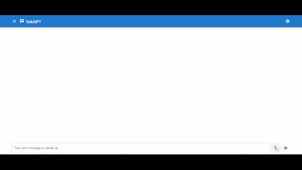

# TalkGPT

TalkGPT is an innovative interface that bridges the gap between OpenAI products, allowing users to interact with ChatGPT using both voice and text. This functionality fills a current gap in OpenAI's offerings, providing users with a seamless and intuitive way to engage with ChatGPT through natural language interactions. With TalkGPT, users can enjoy a more immersive and versatile experience when communicating with AI-driven conversational agents.

## Demo

## Features

1. **Voice Interaction**: Engage with ChatGPT using voice commands, enabling a more natural and hands-free communication experience.

2. **Text Chat**: Communicate with ChatGPT via text input, allowing for typed interactions tailored to your preference.

3. **Seamless Integration**: Easily connect to OpenAI products through the TalkGPT interface for a smooth and cohesive user experience.

4. **Customizable Settings**: Personalize your TalkGPT experience with adjustable settings for voice recognition, language preferences, and more.

5. **Real-time Responses**: Receive instant and accurate responses from ChatGPT, enhancing the efficiency and dynamism of your conversations.

6. **User-Friendly Interface**: Navigate TalkGPT with an intuitive and user-friendly interface designed for accessibility and ease of use.

## Prerequisites

- Docker
- Docker Compose
- OpenAI Api Key

## How to Run

1. Clone this repository to your local machine.
2. Navigate to the project directory.
3. Run `docker-compose up` to build and start the services.
4. Access the UI service at `http://localhost:5173`.
5. The web service will be available at `http://localhost:3000`.
6. The database will be available at `http://localhost:3306`.

## Services

- **UI Service**

  - Build: `./TalkGPT.UI`
  - Ports: `5173:80`

- **Web Service**

  - Build: `./TalkGPT.Server`
  - Ports: `3000:3000`
  - Dependencies: `db`
  - Volumes: `./audio:/app/upload`

- **Database Service**
  - Image: `mysql:latest`
  - Environment:
    - `MYSQL_USER: TALK`
    - `MYSQL_PASSWORD: Password123`
    - `MYSQL_DATABASE: TALKGPT`
    - `MYSQL_RANDOM_ROOT_PASSWORD: true`
  - Ports: `3306:3306`
  - Volumes: `./data:/var/lib/mysql`

## 🤝 Contributing

Contributions, issues and feature requests are welcome. 
Feel free to check [issues page](https://github.com/gustavocaldassouza/TalkGPT/issues) if you want to contribute. 
